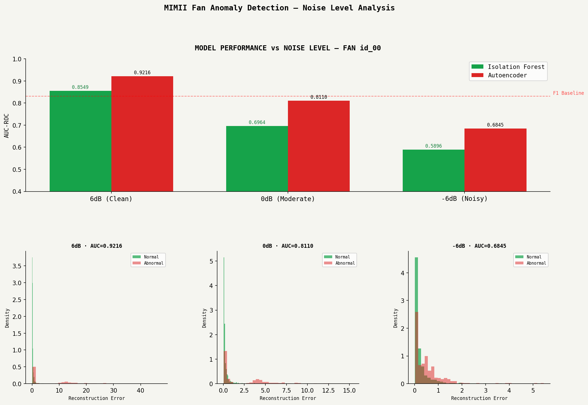

# MIMII Industrial Anomaly Detection System

> Detecting faulty industrial machines from audio using deep learning — PyTorch autoencoder, FastAPI, React.


---

## What This Is

A full-stack machine learning system that detects anomalous sounds in industrial machines using real factory audio from the [MIMII dataset](https://zenodo.org/record/3384388) (Hitachi, 2019).

The system was trained on **normal machine sounds only** — no anomaly examples during training. At inference time, the model flags sounds that deviate from what it learned as "normal." This mirrors real factory conditions where healthy machine recordings are abundant but fault examples are rare.

**Results:**

| Machine | Noise Level    | Isolation Forest | Autoencoder |
| ------- | -------------- | ---------------- | ----------- |
| Fan     | 6dB (Clean)    | 0.8549           | **0.9216**  |
| Fan     | 0dB (Moderate) | 0.6964           | **0.8110**  |
| Fan     | -6dB (Noisy)   | 0.5896           | **0.6845**  |
| Pump    | 6dB (Clean)    | 0.9742           | **0.9982**  |
| Pump    | 0dB (Moderate) | 0.9282           | **0.9755**  |
| Pump    | -6dB (Noisy)   | 0.8865           | **0.9233**  |

All AUC-ROC scores. Previous project baseline (F1 race predictor): 0.831.

---

## Key Finding

Pump anomalies are significantly easier to detect than fan anomalies across all noise levels. Even at -6dB (very noisy factory floor), pump detection (0.9233) exceeds fan detection under clean conditions (0.9216). This reflects the physics — pump faults produce distinctive low-frequency hydraulic signatures. Fan faults are subtler due to more gradual acoustic deviation.

---

## Stack

| Layer            | Technology              |
| ---------------- | ----------------------- |
| Audio processing | librosa                 |
| ML models        | scikit-learn, PyTorch   |
| Local database   | SQL Server Express      |
| Cloud database   | Supabase (PostgreSQL)   |
| Backend API      | FastAPI                 |
| Frontend         | React + Recharts + Vite |

---

## Project Structure

**`src/`** — Core Python package
- `audio/features.py` — MFCC, spectral centroid, RMS, ZCR extraction
- `models/autoencoder.py` — PyTorch autoencoder (34→8→34)
- `database/connection.py` — SQLAlchemy SQL Server connection

**`api/`** — FastAPI backend
- `main.py` — App entry point + CORS
- `routes/machines.py` — GET /machines
- `routes/predictions.py` — POST /predictions/predict
- `routes/analytics.py` — GET /analytics/*

**`frontend/src/`** — React frontend
- `pages/Dashboard.jsx` — Hero stats + noise level comparison chart
- `pages/Analytics.jsx` — Score distribution + model metrics
- `pages/Upload.jsx` — Live WAV file prediction + anomaly gauge
- `pages/Machines.jsx` — Machine registry table
- `api.js` — Axios API calls

**`notebooks/`** — Jupyter exploration + training
- `01_eda.ipynb` — Waveform + spectrogram visualisation
- `02_feature_extraction.ipynb` — Feature pipeline + SQL Server write
- `03_model_baseline.ipynb` — Isolation Forest
- `04_autoencoder.ipynb` — PyTorch autoencoder training
- `05_noise_levels.ipynb` — Fan 0dB and -6dB
- `06_pump.ipynb` — Pump all noise levels

**`data/processed/`** — Feature CSVs + result plots  
**`SYSTEM_DESIGN.md`** — Architecture decisions, trade-offs, failure modes  
**`requirements.txt`** — Python dependencies

---


## How It Works

### 1. Feature Extraction

Each 10-second WAV file (16kHz mono) is converted into a 34-dimensional feature vector:

- **13 MFCC means + 13 MFCC stds** — compact spectral fingerprint
- **Spectral centroid mean/std** — centre of frequency mass
- **Spectral bandwidth mean/std** — spread of active frequencies
- **RMS energy mean/std** — loudness profile
- **Zero crossing rate mean/std** — signal roughness

### 2. Models

**Isolation Forest (baseline)** — trained on normal samples only. Anomalies are easier to isolate in feature space so they receive higher anomaly scores.

**PyTorch Autoencoder (primary)** — learns to reconstruct normal sounds. At inference, reconstruction error becomes the anomaly score. Sounds the network has never learned (anomalies) reconstruct poorly.

Architecture: `34 → 32 → 16 → 8 → 16 → 32 → 34` with BatchNorm and Dropout.

### 3. API

FastAPI backend with real-time prediction — upload any WAV file, get an anomaly score + latency breakdown in ~40ms.

### 4. Frontend

React dashboard with an industrial oscilloscope aesthetic. Four pages: Dashboard, Analytics, Live Demo, Machines. All data fetched live from the API.

---

## Running Locally

### Prerequisites

- Python 3.11
- SQL Server Express
- Node.js 18+

### Backend

```powershell
# Create and activate virtual environment
python -m venv .venv311
.venv311\Scripts\Activate.ps1

# Install dependencies
pip install -r requirements.txt

# Start API
uvicorn api.main:app --reload --port 8000
```

### Frontend

```powershell
cd frontend
npm install
npm run dev
```

Open **http://localhost:5173**

### Environment Variables

Create a `.env` file in the project root:
SQL_SERVER=YOUR_SERVER\SQLEXPRESS
SQL_DATABASE=mimii_anomaly
SUPABASE_URL=your_supabase_url
SUPABASE_KEY=your_supabase_key

---

## Dataset

[MIMII Dataset](https://zenodo.org/record/3384388) — Purohit et al., Hitachi Ltd., 2019.

Four machine types: fan, pump, valve, sliding rail. Each with multiple machine IDs and three noise levels (6dB, 0dB, -6dB SNR). Audio: 16kHz mono WAV, 10 seconds per clip.

> Dataset not included in this repository. Download from Zenodo and place in `data/raw/`.

---

## System Design

See [SYSTEM_DESIGN.md](SYSTEM_DESIGN.md) for full architecture decisions, trade-offs, failure modes, and scaling strategy.

---

## Results Visualisations



---
